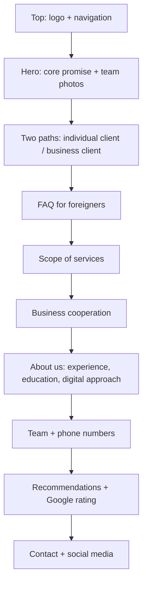

# EB Partners Website Outline

## Website Goal

The website should quickly respond to two different user needs:

1. An individual client wants to understand what they need, how to legally organize their residence or work status, and how to contact EB Partners as quickly as possible.
2. A business client wants to know whether EB Partners can provide ongoing immigration-related support for a company, employment agency, or HR department.

Communication tone: professional, warm, clear, modern, digital-first, grounded in legal education and compliance.

## Core Promise

Main message:

> Residence and work legalization without chaos.

More premium option:

> We save your time. We keep your case compliant.

More empathetic option:

> In a foreign country, paperwork should not feel like a lonely fight.

Recommended hero headline:

> Residence and work legalization without chaos.

Supporting copy:

> We help foreigners and companies navigate immigration processes clearly, efficiently, and in compliance with the law. We save your time, organize your documents, and guide communication with public authorities step by step.

CTA:

- Book a consultation
- View services
- Business cooperation

## Proposed Page Order



Red alert:

We are not implementing this section for now. If added later, the best place for it would be between the hero and the two-path section. It could use a CTA such as "Urgent case - call now".

## Section 1: Hero

Goal:

Immediately show that EB Partners supports both individuals and businesses, without overloading the first screen.

Layout:

- Left side: headline, short description, CTA.
- Right side: photos of Ewa and Benna.
- Below or near the photos: two phone numbers.

Copy:

**Residence and work legalization without chaos.**

We help foreigners and companies navigate immigration processes clearly, efficiently, and in compliance with the law. We save your time, organize your documents, and guide communication with public authorities step by step.

CTA:

- Book a consultation
- I am an individual client
- I represent a company

Contact near the team:

- Ewa: +48 571 536 626
- Benna: +48 503 325 049

## Section 2: Two Paths

Goal:

The user should quickly recognize which path is relevant to them. This section should appear high on the page, ideally directly after the hero.

### Individual Client

Headline:

**For foreigners who want to safely organize their residence and work status in Poland.**

Copy:

We explain what you need, review your documents, prepare a strategy, and support you in communication with public administration authorities.

Key points:

- immigration consulting for foreigners
- residence legalization
- support in administrative procedures
- analysis of documents from the employer
- contact and representation before public administration authorities

CTA:

Let us talk about your case

### Business Client

Headline:

**For companies, employment agencies, and HR teams hiring foreigners.**

Copy:

We help companies handle immigration-related cases in a repeatable, efficient, and compliant way. We can work on a per-client fee model or as a subscription/retainer.

Key points:

- support for foreign candidates and employees
- analysis of documents provided by the employer
- HR support in work and residence legalization processes
- ongoing cooperation for companies with a regular number of cases
- compliance and organized procedures

CTA:

Ask about B2B cooperation

## Section 3: FAQ for Foreigners

Goal:

This section should be practical and friendly, especially for someone in a foreign country who may not know administrative procedures or official language.

Suggested questions:

1. I do not know where to start with residence legalization. What should I do?
2. My legal stay in Poland is about to expire. Can I still do something?
3. My employer wants to hire me. What documents should they prepare?
4. I received a letter from the office. Can you help me understand it?
5. Can you represent me before the office?
6. Do you help with refusals or appeals?
7. What languages can I contact you in?

Languages:

PL, EN, UA, RU, ES

Future multilingual versions:

The target website languages are Polish, English, Ukrainian, Turkish, Spanish, and Russian.

## Section 4: Scope of Services

Goal:

Group services into clear categories instead of a generic list.

Service cards:

### Immigration Consulting

Situation analysis, choosing the right path, and explaining next steps in clear language.

### Residence Legalization

Support in preparing documents and handling residence-related cases.

### Administrative Procedures

Help with communication with public administration authorities, responses to official letters, and document supplementation.

### Employer Document Analysis

Reviewing documents required for legal work and residence.

### Representation Before Authorities

Support in communication with public administration and handling the case on behalf of the client where possible.

## Section 5: Business Cooperation

Goal:

Show that companies are not an add-on, but a separate audience segment.

Headline:

**Ongoing immigration support for companies and employment agencies.**

Copy:

If you regularly hire foreigners or refer multiple cases per month, we can define a cooperation model tailored to your case volume and your organization's workflow.

Cooperation models:

### Per-Client Fee

A good option for companies and agencies that refer cases irregularly or want to settle each case separately.

### Subscription / Retainer

For partners who refer a stable number of cases each month and need a predictable process and priority communication.

### Consultations and Document Audit

For companies that want to verify processes, documents, or risks before hiring foreigners.

CTA:

Schedule a conversation about B2B cooperation

## Section 6: About Us

Goal:

Build credibility by showing that EB Partners is not a company created only because someone managed to handle their own case, but a team with legal education, experience, and a modern approach.

Headline:

**Legal education, 7 years of experience, and a fresh approach to immigration cases.**

Copy:

We combine legal knowledge, practical experience, and a digital approach to client service. We understand the reality of constantly changing regulations and know how important clear communication is, especially when the client is operating in a foreign country.

Key differentiators:

- 7 years of experience in legal and immigration-related matters
- legal education
- Benna's diploma from London
- ongoing work with changes in the law
- digital case management and communication
- service in PL, EN, UA, RU, ES

Content note:

Studies should be presented separately as "legal education" and "international preparation", while professional experience should be communicated as 7 years. This sounds both honest and strong.

## Section 7: Team and Quick Contact

Goal:

Show the people behind the company and make contact immediate.

Layout:

Two photo cards:

### Ewa

Main contact number: +48 571 536 626

Working role:

Immigration consulting, client contact, case management.

### Benna

Phone: +48 503 325 049

Working role:

Support for international clients, case handling, and multilingual communication.

To clarify:

Official roles and professional titles.

## Section 8: Recommendations and Google

Goal:

Build social proof and trust.

Layout:

- average Google rating
- number of reviews
- 3-6 selected recommendations
- link to Google profile

Placeholder:

**Google rating: [average] / 5**

**[number] client reviews**

For the first version, reviews can be entered manually. Later, a Google Places API integration or a widget can be considered.

## Section 9: Contact and Social Media

Goal:

Make contact easy without forcing users to search.

Elements:

- contact form
- phone Ewa: +48 571 536 626
- phone Benna: +48 503 325 049
- email
- Facebook placeholder
- Instagram placeholder
- Google profile placeholder

Social media:

Icons are best placed in the footer and possibly in the contact section. They can be added to the header later, but for the first version it is better not to overload the top navigation.

## Navigation

Proposed navigation links:

- For You
- For Companies
- FAQ
- Services
- About Us
- Reviews
- Contact

Shorter alternative:

- Individual Clients
- Companies
- FAQ
- About Us
- Contact

Recommendation:

On desktop, use shorter labels so the top bar does not feel too heavy:

- For You
- For Companies
- FAQ
- About Us
- Contact

## Visual Wireframe

```text
┌──────────────────────────────────────────────────────────────┐
│ GREEN TOP 30%                                                │
│ [large EB Partners logo]       For You | Companies | FAQ...  │
└──────────────────────────────────────────────────────────────┘

┌───────────────────────────────┬──────────────────────────────┐
│ Residence and work            │ EB Partners Team             │
│ legalization without chaos.   │ [Ewa photo] [Benna photo]    │
│                               │ tel. Ewa / tel. Benna        │
│ We save your time...          │                              │
│ [Book consultation] [Company] │                              │
└───────────────────────────────┴──────────────────────────────┘

┌───────────────────────────────┬──────────────────────────────┐
│ For foreigners                │ For companies and agencies   │
│ Residence, work, documents    │ Ongoing support, HR, retainer│
└───────────────────────────────┴──────────────────────────────┘

┌──────────────────────────────────────────────────────────────┐
│ FAQ for foreigners                                            │
│ quick questions, short answers, contact CTA                   │
└──────────────────────────────────────────────────────────────┘

┌──────────────────────────────────────────────────────────────┐
│ Scope of services                                             │
│ Consulting | Residence | Administration | Documents | Rep.    │
└──────────────────────────────────────────────────────────────┘

┌──────────────────────────────────────────────────────────────┐
│ Business cooperation                                          │
│ Per-client fee | Subscription | Document audit                │
└──────────────────────────────────────────────────────────────┘

┌──────────────────────────────────────────────────────────────┐
│ About us                                                      │
│ 7 years of experience | legal education | digital approach    │
└──────────────────────────────────────────────────────────────┘

┌──────────────────────────────────────────────────────────────┐
│ Recommendations + Google rating                              │
└──────────────────────────────────────────────────────────────┘

┌──────────────────────────────────────────────────────────────┐
│ Contact + social media                                        │
└──────────────────────────────────────────────────────────────┘
```

## Questions Before Implementation

1. What official roles should be used for Ewa and Benna?
2. What public email address should be shown?
3. Should WhatsApp be linked to both numbers or only to Ewa's main number?
4. Should the B2B cooperation section show prices, or only describe cooperation models and use a CTA for a conversation?
5. Does the Google profile already exist, and are there reviews we can quote?
6. In the hero, should we say "residence and work legalization" or more broadly "immigration consulting and residence legalization"?

## Recommended Implementation Plan

1. Rebuild the page structure according to this document.
2. Add real phone numbers near the team section and in the contact section.
3. Write the FAQ for individual clients in simple, accessible language.
4. Add a dedicated B2B section with "per-client fee" and "subscription/retainer" models.
5. Rework the About Us section around legal education, 7 years of experience, and a digital approach.
6. Add social media placeholders until links are provided.
7. After publication, collect the Google Reviews link and add recommendations.
