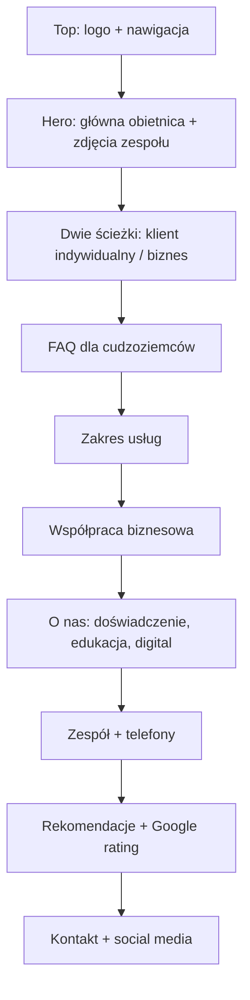

# Szkic strony EB Partners

## Cel strony

Strona ma szybko odpowiedzieć na dwa różne typy potrzeb:

1. Klient indywidualny chce zrozumieć, czego potrzebuje, jak legalnie uporządkować pobyt lub pracę i jak najszybciej skontaktować się z EB Partners.
2. Klient biznesowy chce wiedzieć, czy EB Partners może stale obsługiwać sprawy cudzoziemców dla firmy, agencji pracy lub działu HR.

Ton komunikacji: profesjonalny, ciepły, jasny, świeży, digitalowy, oparty na wykształceniu prawniczym i compliance.

## Główna obietnica

Hasło przewodnie:

> Legalizacja pobytu i pracy bez chaosu.

Wariant bardziej premium:

> Oszczędzamy Twój czas. Prowadzimy sprawy zgodnie z prawem.

Wariant bardziej empatyczny:

> W obcym kraju formalności nie muszą być samotną walką.

Rekomendacja na hero:

> Legalizacja pobytu i pracy bez chaosu.

Tekst pod spodem:

> Pomagamy cudzoziemcom i firmom przejść przez procesy migracyjne jasno, sprawnie i zgodnie z prawem. Oszczędzamy Twój czas, porządkujemy dokumenty i prowadzimy komunikację z urzędami krok po kroku.

CTA:

- Umów konsultację
- Sprawdź usługi
- Współpraca dla firm

## Proponowana kolejność strony



Red alert:

Na razie nie wdrażamy. W architekturze najlepsze miejsce na tę sekcję to pomiędzy hero a dwiema ścieżkami. W przyszłości może mieć CTA typu "Pilna sprawa - zadzwoń teraz".

## Sekcja 1: Hero

Cel:

Od razu pokazać, że EB Partners pomaga zarówno ludziom, jak i firmom, ale bez przeładowania pierwszego ekranu.

Układ:

- Lewa strona: hasło, krótki opis, CTA.
- Prawa strona: zdjęcia Ewy i Benny.
- Pod zdjęciami lub w pobliżu: dwa numery telefonu.

Treść:

**Legalizacja pobytu i pracy bez chaosu.**

Pomagamy cudzoziemcom i firmom przejść przez procesy migracyjne jasno, sprawnie i zgodnie z prawem. Oszczędzamy Twój czas, porządkujemy dokumenty i prowadzimy komunikację z urzędami krok po kroku.

CTA:

- Umów konsultację
- Jestem klientem indywidualnym
- Reprezentuję firmę

Kontakt przy zespole:

- Ewa: +48 571 536 626
- Benna: +48 503 325 049

## Sekcja 2: Dwie ścieżki

Cel:

Użytkownik ma szybko odnaleźć swoją sytuację. Ta sekcja powinna być bardzo wysoko, najlepiej zaraz po hero.

### Klient indywidualny

Nagłówek:

**Dla cudzoziemców, którzy chcą bezpiecznie uporządkować pobyt i pracę w Polsce.**

Treść:

Wyjaśniamy, czego potrzebujesz, sprawdzamy dokumenty, przygotowujemy strategię i wspieramy Cię w kontakcie z administracją publiczną.

Punkty:

- doradztwo migracyjne dla cudzoziemców
- legalizacja pobytu
- wsparcie w procesach administracyjnych
- analiza dokumentów od pracodawcy
- kontakt i reprezentacja przed jednostkami administracji publicznej

CTA:

Porozmawiajmy o Twojej sprawie

### Klient biznesowy

Nagłówek:

**Dla firm, agencji pracy i zespołów HR zatrudniających cudzoziemców.**

Treść:

Pomagamy firmom obsługiwać sprawy migracyjne powtarzalnie, sprawnie i zgodnie z przepisami. Możemy pracować w modelu rozliczenia za klienta albo w abonamencie.

Punkty:

- obsługa kandydatów i pracowników cudzoziemskich
- analiza dokumentów dostarczanych przez pracodawcę
- wsparcie HR w procesach legalizacji pracy i pobytu
- stała współpraca dla firm dostarczających regularną liczbę spraw
- compliance i uporządkowanie procedur

CTA:

Zapytaj o współpracę B2B

## Sekcja 3: FAQ dla cudzoziemców

Cel:

Ta sekcja ma być praktyczna i przyjazna, zwłaszcza dla osoby w obcym kraju, która może nie znać procedur i języka urzędowego.

Proponowane pytania:

1. Nie wiem, od czego zacząć legalizację pobytu. Co mam zrobić?
2. Kończy mi się legalny pobyt w Polsce. Czy mogę jeszcze coś zrobić?
3. Pracodawca chce mnie zatrudnić. Jakie dokumenty powinien przygotować?
4. Dostałem pismo z urzędu. Czy możecie pomóc mi je zrozumieć?
5. Czy możecie reprezentować mnie przed urzędem?
6. Czy pomagacie w sprawach odmowy lub odwołania?
7. W jakich językach można się z Wami skontaktować?

Języki:

PL, EN, UA, RU, ES

W przyszłości:

Docelowo wersje językowe strony: polski, angielski, ukraiński, turecki, hiszpański, rosyjski.

## Sekcja 4: Zakres usług

Cel:

Zebrać usługi w jasne kategorie zamiast ogólnej listy.

Karty usług:

### Doradztwo migracyjne

Analiza sytuacji, wybór właściwej ścieżki i wyjaśnienie kolejnych kroków prostym językiem.

### Legalizacja pobytu

Wsparcie w przygotowaniu dokumentów i prowadzeniu spraw pobytowych.

### Procesy administracyjne

Pomoc w kontakcie z jednostkami administracji publicznej, odpowiedziach na pisma i uzupełnianiu dokumentów.

### Analiza dokumentów od pracodawcy

Sprawdzanie dokumentów potrzebnych do legalnej pracy i pobytu.

### Reprezentacja przed urzędami

Wsparcie w komunikacji z administracją i prowadzeniu sprawy w imieniu klienta, gdy jest to możliwe.

## Sekcja 5: Współpraca biznesowa

Cel:

Pokazać, że firmy nie są "dodatkiem", tylko osobnym segmentem oferty.

Nagłówek:

**Stała obsługa migracyjna dla firm i agencji pracy.**

Treść:

Jeśli regularnie zatrudniasz cudzoziemców albo przekazujesz wiele spraw miesięcznie, możemy ustalić model współpracy dopasowany do liczby klientów i tempa pracy Twojej organizacji.

Modele współpracy:

### Stawka za klienta

Dobre rozwiązanie dla firm i agencji, które przekazują sprawy nieregularnie albo chcą rozliczać się za konkretną obsługę.

### Subskrypcja / abonament

Dla partnerów, którzy co miesiąc przekazują stałą liczbę spraw i potrzebują przewidywalnego procesu oraz priorytetowej komunikacji.

### Konsultacje i audyt dokumentów

Dla firm, które chcą zweryfikować procesy, dokumenty lub ryzyka przed zatrudnieniem cudzoziemców.

CTA:

Umów rozmowę o współpracy B2B

## Sekcja 6: O nas

Cel:

Zbudować wiarygodność przez pokazanie, że EB Partners nie jest firmą założoną "bo komuś udało się ogarnąć własną sprawę", tylko zespołem z edukacją prawniczą, doświadczeniem i nowoczesnym podejściem.

Nagłówek:

**Wykształcenie prawnicze, 7 lat doświadczenia i świeże podejście do spraw migracyjnych.**

Treść:

Łączymy wiedzę prawniczą, praktyczne doświadczenie i digitalowe podejście do obsługi klienta. Znamy realia stale zmieniających się przepisów i wiemy, jak ważna jest jasna komunikacja, szczególnie gdy klient działa w obcym kraju.

Punkty wyróżniające:

- 7 lat doświadczenia w sprawach prawnych i migracyjnych
- wykształcenie prawnicze
- dyplom Benny z Londynu
- bieżąca praca ze zmianami w prawie
- digitalowe prowadzenie spraw i komunikacji
- obsługa w językach: PL, EN, UA, RU, ES

Uwaga do treści:

Studia warto ująć osobno jako "wykształcenie prawnicze" i "międzynarodowe przygotowanie", a doświadczenie zawodowe pokazać jako 7 lat. To brzmi uczciwie i mocno.

## Sekcja 7: Zespół i szybki kontakt

Cel:

Pokazać twarze i natychmiast dać możliwość kontaktu.

Układ:

Dwie karty z fotografiami:

### Ewa

Główny numer kontaktowy: +48 571 536 626

Rola robocza:

Doradztwo migracyjne, kontakt z klientem, prowadzenie spraw.

### Benna

Telefon: +48 503 325 049

Rola robocza:

Wsparcie klientów międzynarodowych, obsługa spraw i komunikacja wielojęzyczna.

Do doprecyzowania:

Oficjalne role i tytuły zawodowe.

## Sekcja 8: Rekomendacje i Google

Cel:

Zbudować zaufanie społeczne.

Układ:

- średnia ocena Google
- liczba opinii
- 3-6 wybranych rekomendacji
- link do profilu Google

Placeholder:

**Ocena Google: [średnia] / 5**

**[liczba] opinii klientów**

Na start można wpisać opinie ręcznie. Później można rozważyć integrację z Google Places API albo widget.

## Sekcja 9: Kontakt i social media

Cel:

Ułatwić szybki kontakt bez szukania.

Elementy:

- formularz kontaktowy
- telefon Ewa: +48 571 536 626
- telefon Benna: +48 503 325 049
- email
- Facebook placeholder
- Instagram placeholder
- Google profile placeholder

Social media:

Ikony najlepiej umieścić w footerze oraz ewentualnie w sekcji kontaktu. W nagłówku można je dodać później, ale na start lepiej nie przeładowywać top paska.

## Nawigacja

Proponowane linki w pasku:

- Dla Ciebie
- Dla firm
- FAQ
- Usługi
- O nas
- Opinie
- Kontakt

Alternatywnie krócej:

- Klienci indywidualni
- Firmy
- FAQ
- O nas
- Kontakt

Rekomendacja:

Na desktopie użyć krótszych nazw, żeby pasek nie był zbyt ciężki:

- Dla Ciebie
- Dla firm
- FAQ
- O nas
- Kontakt

## Szkic wizualny strony

```text
┌──────────────────────────────────────────────────────────────┐
│ ZIELONY TOP 30%                                              │
│ [duże logo EB Partners]       Dla Ciebie | Dla firm | FAQ... │
└──────────────────────────────────────────────────────────────┘

┌───────────────────────────────┬──────────────────────────────┐
│ Legalizacja pobytu i pracy    │ Zespół EB Partners           │
│ bez chaosu.                   │ [Ewa photo] [Benna photo]    │
│                               │ tel. Ewa / tel. Benna        │
│ Oszczędzamy Twój czas...      │                              │
│ [Umów konsultację] [Firmy]    │                              │
└───────────────────────────────┴──────────────────────────────┘

┌───────────────────────────────┬──────────────────────────────┐
│ Dla cudzoziemców              │ Dla firm i agencji pracy     │
│ Pobyt, praca, dokumenty       │ Stała obsługa, HR, abonament │
└───────────────────────────────┴──────────────────────────────┘

┌──────────────────────────────────────────────────────────────┐
│ FAQ dla cudzoziemców                                          │
│ szybkie pytania, krótkie odpowiedzi, CTA do kontaktu          │
└──────────────────────────────────────────────────────────────┘

┌──────────────────────────────────────────────────────────────┐
│ Zakres usług                                                  │
│ Doradztwo | Pobyt | Administracja | Dokumenty | Reprezentacja │
└──────────────────────────────────────────────────────────────┘

┌──────────────────────────────────────────────────────────────┐
│ Współpraca biznesowa                                          │
│ Stawka za klienta | Subskrypcja | Audyt dokumentów            │
└──────────────────────────────────────────────────────────────┘

┌──────────────────────────────────────────────────────────────┐
│ O nas                                                         │
│ 7 lat doświadczenia | wykształcenie prawnicze | digital       │
└──────────────────────────────────────────────────────────────┘

┌──────────────────────────────────────────────────────────────┐
│ Rekomendacje + Google rating                                  │
└──────────────────────────────────────────────────────────────┘

┌──────────────────────────────────────────────────────────────┐
│ Kontakt + social media                                        │
└──────────────────────────────────────────────────────────────┘
```

## Pytania przed implementacją

1. Jakie oficjalne role wpisać przy Ewie i Bennie?
2. Jaki email ma być publiczny?
3. Czy WhatsApp ma być podpięty pod oba numery, czy tylko pod główny numer Ewy?
4. Czy współpraca B2B ma mieć widoczne ceny, czy tylko opis modeli i CTA do rozmowy?
5. Czy profil Google już istnieje i czy ma opinie, które możemy zacytować?
6. Czy w hero mówimy "legalizacja pobytu i pracy", czy szerzej "doradztwo migracyjne i legalizacja pobytu"?

## Rekomendowany plan wdrożenia

1. Przebudować strukturę strony zgodnie z kolejnością z tego dokumentu.
2. Uzupełnić realne telefony przy zespole i w kontakcie.
3. Napisać FAQ dla klienta indywidualnego prostym językiem.
4. Dodać osobną sekcję B2B z modelami "stawka za klienta" i "abonament".
5. Uporządkować sekcję O nas wokół edukacji prawniczej, 7 lat doświadczenia i digitalowego podejścia.
6. Dodać social media jako placeholdery do czasu podania linków.
7. Po publikacji zebrać link Google Reviews i uzupełnić rekomendacje.
